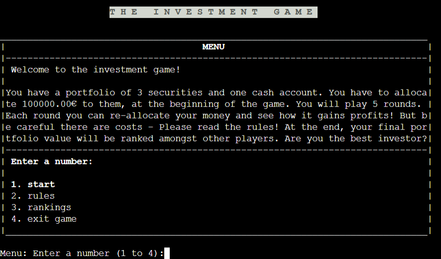
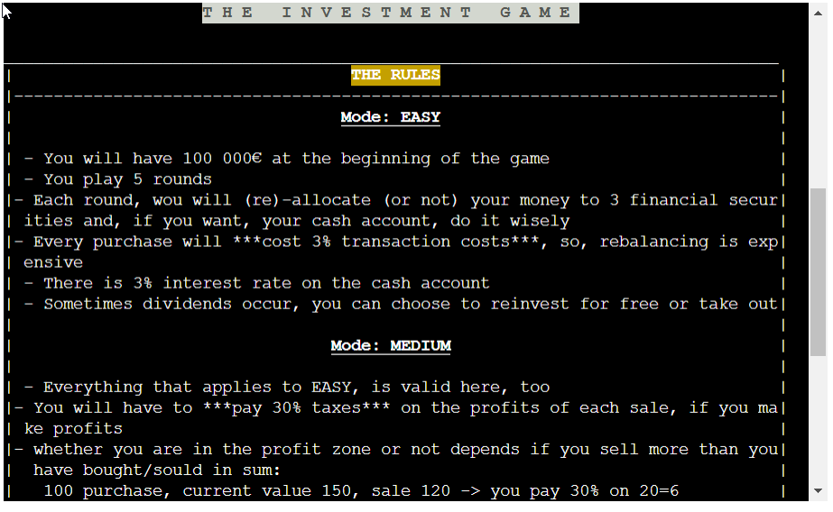
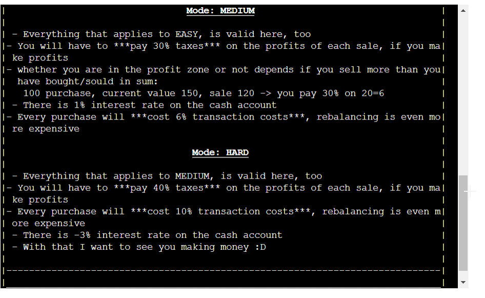
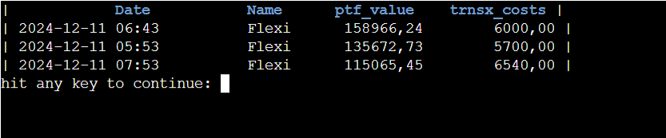
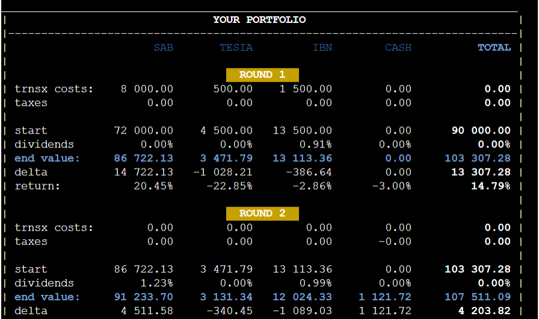
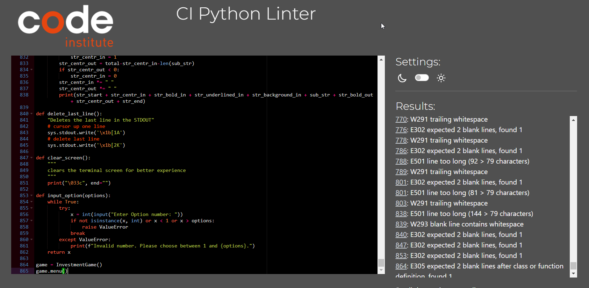

(Developer: Felix Lehmann)  
**11/12/2024**

This project is a playful simulation of an investment into 3 securities with the help of a cash account. The player will allocate, rebalance his/her money over five rounds and needs to make tactical decision related to tax payments, dividend payments, transaction costs, risk free rates of the cash account etc.

**The challenge in this project** is that there are no interfaces allowed. This forces me as the developer to think of simple ways to make game options. As a result, I decided to use classical "legacy" concepts such as a start menu and choosing options by entering numbers. For the rankings and the game overviews, however, I tried to simulate tables which makes it easier to understand numbers. For that I created functions which aligns the content with the 80 characters width.

__Information on the data of financial instruments__
They are fictive, even if they are oriented on real data to make the data acquisition faster. Randomly, prices and dates were modified and anonymized.

# How to play
As one can assume, this game can become very complex. The complexity is addressed by creating 3 game modes: easy, medium, hard.

## Easy Mode
All beginners should start here. The player starts with 100 000€ which need to be invested into 3 securities (equities/shares) and, if s/he wants into the cash account. The player will play **5 rounds**. The goal is to maximize the portfolio value. 

At the beginning of a round (the pre-round phase) the player can reallocate (in the first round must) and has to deal with costs. Transaction costs of 3% will charged for each purchase. Once, the allocation is confirmed by the player, the actual investment phase starts. The portfolio will grow or decrease, based on the market. At the end of the round, the player will be informed about occured dividends. S/he is allowed to re-invest for free or to take it out to the cash. After that, the new market values will be revealed to the player. The cash account pays a riskfree rate for the money parked of 3% per round. All numbers will be shown to the player. It's time for analysis. Costs are listed, returns and deltas are transparent etc. based on that, the next round can be planned.

## Medium Mode
This is a more complex mode. In the pre-round phase, the player not only has to deal with transaction costs of 6% but also is obliged to pay a 30% flat-tax rate on all profits realized by sales. Rebalancing is now an increasing cost factor. Moreover, the cash account will only pay a 1% risk-free rate per round.

## Hard Mode
The hard mode is not more complex than Medium mode but more expensive. The transaction costs increased to 8%, the tax rate to 40% and the cash acount is now charging 3% per round from the player, when s/he deposits money there. Good luck with this mode!

# Features
- **menu board**
  - as you can see below, the game starts with a classical menu, offering options to increase the user experience 
  - the width is adjusted to this app's screen but can dynamically be changed as a constant is used for the fix width
    

- **rules board**
  - the same functions are used to reproduce the board over and over again -> you just need to hand over the text(s) to display and some formatting boolean (background, underlined, bold etc.)
  - the rules are explained in details - an example for the tax calculation is shown
  - this board exists to make the player understand their actions
  - finally, the player can navigate back to the start menu

  

  

- **rankings boards**
  - this feature shall make the game more interesting
  - it uses google spreadsheet API to retrieve data from the best players 
  - the player can orientate and compete by the total portfolio value and the paid costs and taxes resp. 
  - there are 3 different lists, one per each game mode

  

- **the game board**
  - probably the most useful board
  - it shows all the necessary numbers to the player, in a relational and useful way
  - it shall help the players with their investment decisions
  - more important numbers are emphasised, less important (if you even can name them like that) are plain in white
  - this board will be reloaded after each round and presented on a cleared screen

  

# Data Model
The model of this project is object oriented, although the board printing functions can be seen as extensions/tools. Each game to be played is an own class. All the necessary settings and up-to-date game data are organized there. This includes the start menu, rules board, rankings boards as well as the actual start of the game.

another class, the round class, is composed into the InvestmentGame class. It doesn't inherit from the InvestmentGame class (as i initially intended) because the single round is not a speciality of the game but rather a component. So, the Game class can hand over all information that the round class needs in order to perform realize all the complex rules. All actions and actual game play processes are managed by the composition class. In the end there is one game class and 5 round classes composed to it at the end of each game.

# Testing

## Bugs
- some calculations can become very complex which increases the risk for even undetected bugs
- typical bugs are formatting issues of new lines, colors and number formatting
- a major but solved bug was the issue of the pre_round confirmation (yeallow header and short overview of impacting costs) 
  - because of syntax error in the gspread methods, the code skipped the confirmation and redirect to the start_menu without a possibility to create an error somewhere.
  - I traced backt the code with prints and board creations until no prints were printed anymore
- another major bug was the mismatch of the board creation width
  - some lines were shorter than others for no obvious reason
  - i found out that anscii-code formatting does have an impact on the fixed witdh of f"{x:<12} -> when this is the anscii-code for bold: "\033[1m", it will take 7 characters from the pre-set 12 from the f-string.
  - i fixed it by making the formatting optional in the method as a boolean - so, i could add the formatting with if-clauses with the method the "proper" way
- finally, a major bug was the ValueError exception
  - at first, it does seem plausible to "just add up all the money" to its portfolio value
  - however, it was very often not possible to enter the exact remaining amount of the cash because of differences < 0.0001
  - i fixed it by checking with thresholds on the entered values -> sum of entered values shall not differ from the should-be-value more than 5%
  - I could have fixed it by using integers only (instead of floating) but this would have been difficult to mix with floating point percentage numbers..

## Remaining Bugs
- minor formatting issues

## Validator Testing
- there are whitespaces and too long lines

# Deployment
This project was deployed using Code Institute's mock terminal for Heroku.
- steps for deployment:
  - fork or clone this repository
  - Create a new Heroku app
  - Set the builbacks to Python and NodeJS in that order
  - Link the Heroku app to the repository
  - Click on Deploy

Please note that google spreadsheet has been used here to save the rankings and the securities time series

# Credits/References
- how to change formatting in the command line text - by [joeld](https://stackoverflow.com/users/19104/joeld) at https://stackoverflow.com/questions/287871/how-do-i-print-colored-text-to-the-terminal
- how to split a string by nth character - by [satomacoto](https://stackoverflow.com/users/1081207/satomacoto) at https://stackoverflow.com/questions/9475241/split-string-every-nth-character
- how to delete the last line in terminal - by [Pedram Elmi](https://stackoverflow.com/users/13737067/pedram-elmi) at https://stackoverflow.com/questions/44565704/how-to-clear-only-last-one-line-in-python-output-console
- how make method variables optional (by using default variables)- by [Stephen Gruppetta](https://realpython.com/python-optional-arguments/#author) at https://realpython.com/python-optional-arguments/
- how to create custom errors - by [Aaron Hall](https://stackoverflow.com/users/541136/aaron-hall) at https://stackoverflow.com/questions/1319615/proper-way-to-declare-custom-exceptions-in-modern-python
- how to multiply element-wise lists - by [gahooa](https://stackoverflow.com/users/64004/gahooa) at 
- gspread library and method in general: https://docs.gspread.org/en/latest/user-guide.html

---

Happy coding!
